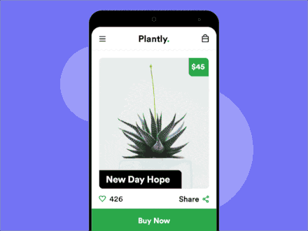
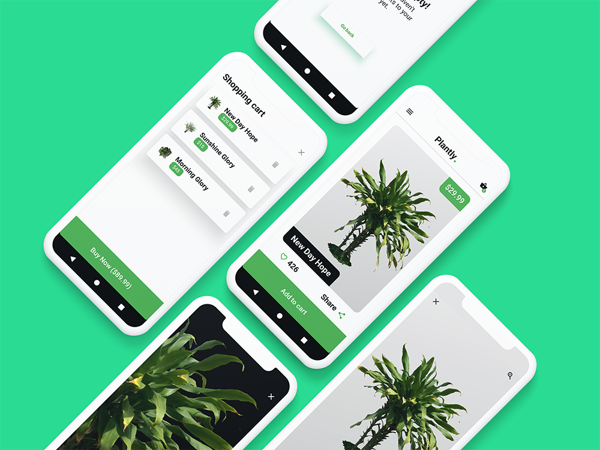
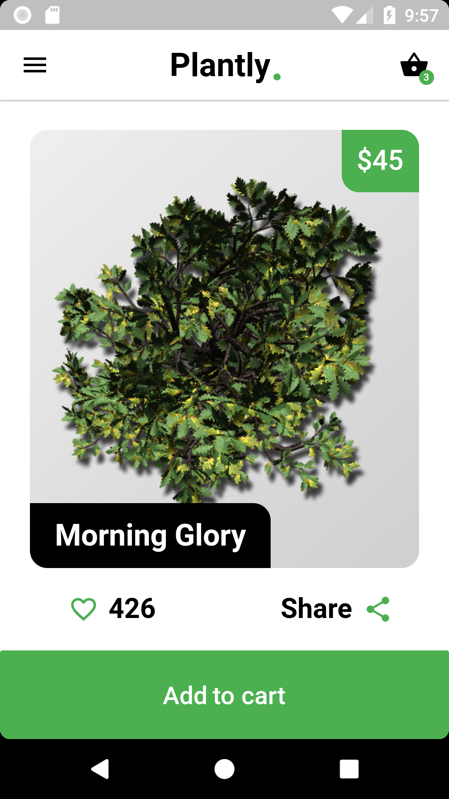
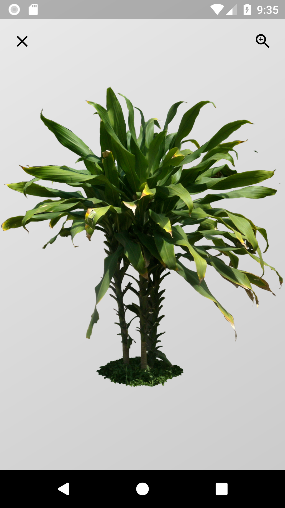
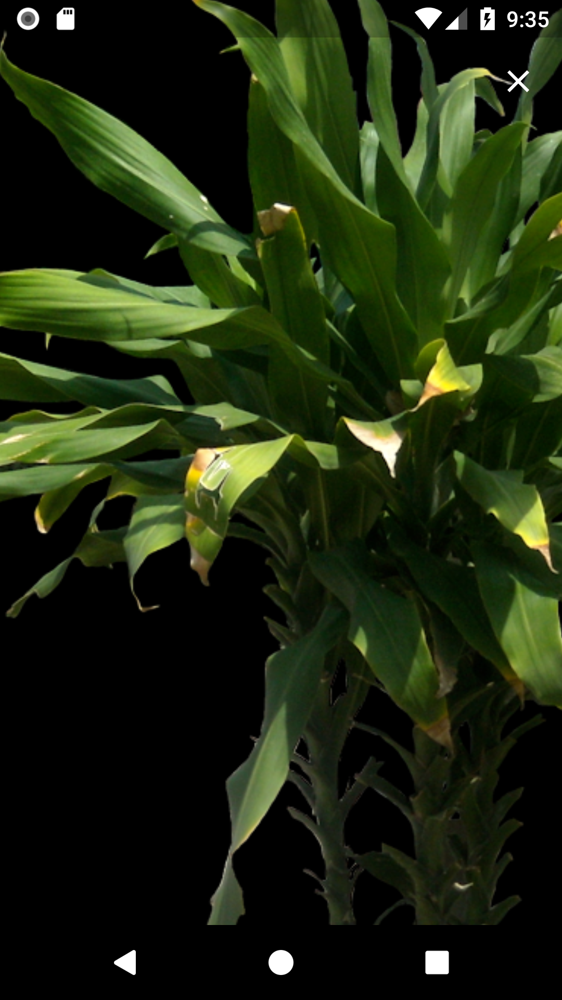
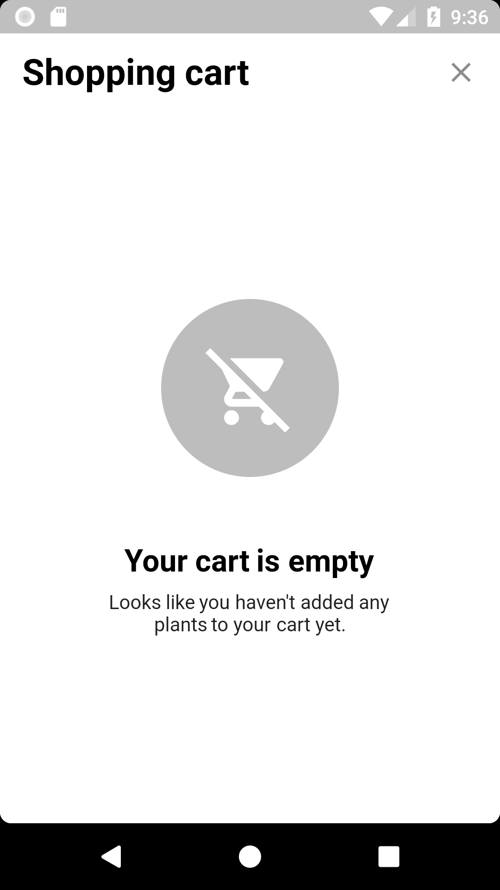
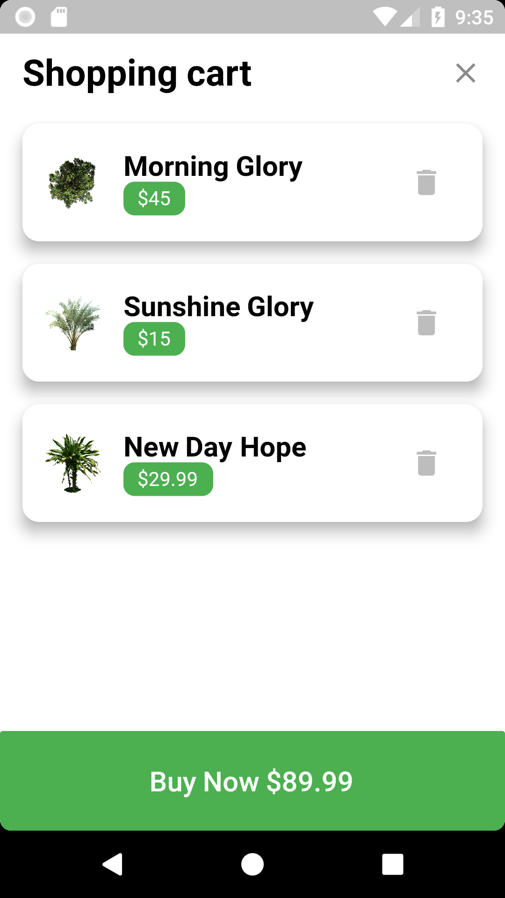

# Plantly: buy plants.
A concept app that I made with Flutter, inspired by this:

Wanna try it? Here's the Play store link: [Plantly](https://play.google.com/store/apps/details?id=com.skuu.plantly).

## Final result

## Screenshots (click to enlarge)
- Main page (plants list) 

- When clicked on a plant image 

- When clicked on the zoom icon 

- Cart page (empty) 

- Cart page with items 

## What I've learned by doing this project
- Make more beautiful shadows
- Used the image_zoom package
- I can round the corners of the whole app (:mindblown:)
- Make the app fullscreen (hide the notification bar and softkeys)
- _You should always backup the key file you used to sign the apk if you still want to update it..._
